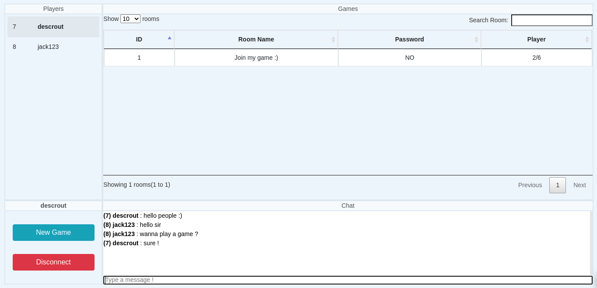
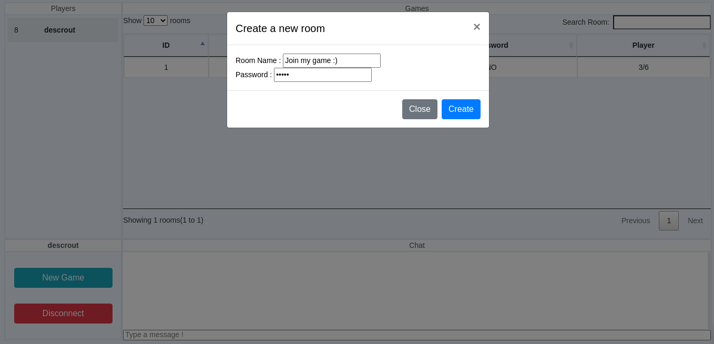
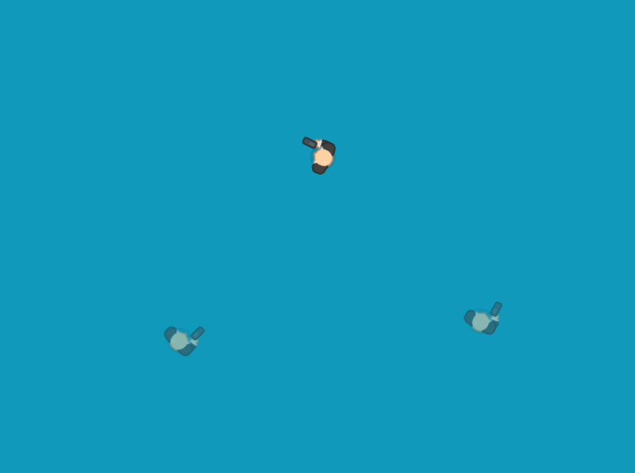

# Webscoket Game Client Example
- After I read the Gabriel Gambetta's [Fast Paced Multiplayer](https://www.gabrielgambetta.com/client-server-game-architecture.html) articles, I decided to implement it for myself.
- You can access to the server counterpart [here.](https://github.com/Descrout/game-server)
### Usage
- Just change the ip/port in the [main.js](https://github.com/Descrout/game-client/blob/master/js/main.js) first line and you are good to go.
### Screenshots

